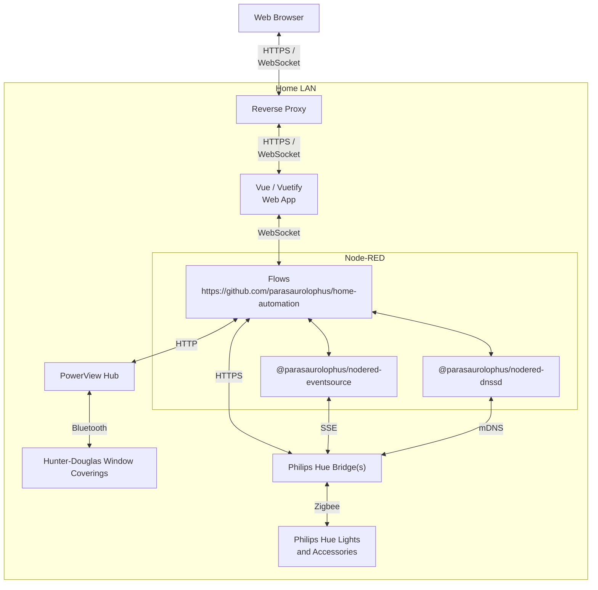
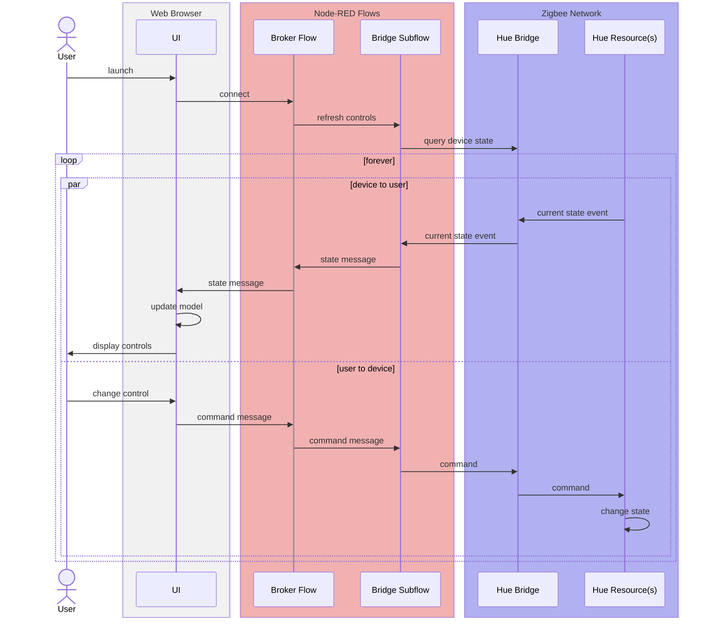

# home-automation

Node-RED based home automation system

> **Note:** these flows use features introduced in Node-RED version 3.0. They
> will not load correctly into earlier versions of Node-RED.



- <https://github.com/parasaurolophus/home-automation>
- <https://flows.nodered.org/node/@parasaurolophus/node-red-dnssd>
- <https://flows.nodered.org/node/@parasaurolophus/node-red-eventsource>

- Entirely self-contained [Node-RED](https://nodered.org) based application
  - **No clouds!!**
  - No external configuration outside of _~/.node-red/settings.js_
    - Does require configuration of host running _Node-RED_ and the home LAN
      router in order to support secure access to the dashboard from outside the
      home[<sup>\*</sup>](#https)
  - No additional servers or services required other than those provided by the
    Hue and PowerView hubs
- Consolidated dashboard / web-based UI using
  [Vue](https://vuejs.org/)/[Vuetify](https://vuetifyjs.com/)
  - Requires separate build step after cloning repo from
    GitHub[<sup>\*\*</sup>](#plainhtml5)
- Time and date based automation
  - Turn on and off lights based on local sunrise / sunset
  - Use special occasion lighting themes based on date
  - Open and close window coverings based on sun's local altitude and azimuth on
    any given day

---

<a id="https"></a> <sup>\*</sup>If remote access is not a priority, just leave
out the HTTPS related configuration from _~/.node-red/settings.js_. Detailed
instructions for obtaining and installing certificates and configuring IP
reservations and port forwarding on routers are beyond the scope of this README.

<a id="plainhtml5"></a> <sup>\*\*</sup>An earlier version of this project
implemented the dashboard using pure HTML 5 / JavaScript for its dashboard which
did not have additional build steps. I admit it. I was led astray by the pretty
toggle switches.

---

## About

These flows implement more sophisticated time-based automation than is supported
directly by popular home automation platforms like Apple HomeKit, Amazon Alexa,
Google Home, Samsung SmartThings, etc., or the native apps supplied by Philips
and Hunter-Douglas. For example, they activate different seasonal lighting
themes automatically based on the date. They also drive window shade automation
based on the sun's position over the course of a day based on the geographic
location of the home and the day of the year.

## Configuration

These flows require some specific configuration in _settings.js_. To facilitate
documenting and sharing these options, the following assumes that these
secctions of _settings.js_ are defined using `require` rather than by directly
embedded JavaScript objects:

- `contextStorage`
- `projects`
- An entry in the `httpStatic` array
- A set of environment variable definitions

This is accomplished by creating a number of separate JavaScript files and
referencing them from `settings.js` by placing the following just above (not
inside) `module.exports`:

```javascript
var environment = require("./environment");
var dashboardPath = require("./dashboardPath");
var contextStorage = require("./contextStorage");
var projects = require("./projects");
```

Each of these JavaScript files consists of its own `module.exports` statement,
described below.

### _environment.js_

Placing the following line above `module.exports` in _settings.js_ loads the
contents of _environment.js_ as a module:

```javascript
var environment = require("./environment");
```

The _environment.js_ file contains definitions of environment variables assumed
by various function nodes and subflows. Here is an example of what it should
look contain:

```javascript
module.exports = {
  // change these to the latitude and longitude
  // of your home
  latitude: (process.env.LATITUDE = "42.1967"),
  longitude: (process.env.LONGITUDE = "-90.0382"),

  // change these to the IP address and access token
  // of your Hue Bridge
  ground_floor_hue_address: (process.env.GROUND_FLOOR_HUE_ADDRESS =
    "192.168.1.40"),
  ground_floor_hue_key: (process.env.GROUND_FLOOR_HUE_KEY =
    "FiLAHkz6wMwa-3bz06K9a8MLfCaSSzR5WxSK8a-y"),

  // you can define multiple Hue Bridge configurations
  basement_hue_address: (process.env.BASEMENT_HUE_ADDRESS = "192.168.1.41"),
  basement_hue_key: (process.env.BASEMENT_HUE_KEY =
    "-7bz1KHa9Lde2QV00yBYQ75bo6hlVBN2mopvXnrNa"),

  // change this to the IP address of your PowerView hub
  powerview_address: (process.env.POWERVIEW_ADDRESS = "192.168.1.42"),

  // don't use "localhost" inside Node-RED due to a bug
  // introduced by Node.js >= 18
  //
  // also, if you have TLS / SSL enabled elsewhere
  // in settings.js, use wss:// here and you will
  // then probably have to use the DNS name in your
  // certificate instead of an IP address
  broker_url: (process.env.BROKER_URL = "ws://127.0.0.1:1880/broker"),
};
```

| Environment Variable       | Description                                                                          |
| -------------------------- | ------------------------------------------------------------------------------------ |
| `LATITUDE`                 | Coordinate for use with [suncalc](https://www.npmjs.com/package/suncalc)             |
| `LONGITUDE`                | Coordinate for use with [suncalc](https://www.npmjs.com/package/suncalc)             |
| `GROUND_FLOOR_HUE_ADDRESS` | IP address of the Hue Bridge controlling devices on the ground floor                 |
| `GROUND_FLOOR_HUE_KEY`     | API access token for the ground floor Hue Bridge                                     |
| `BASEMENT_HUE_ADDRESS`     | IP address of the Hue Bridge controlling devices in the basement                     |
| `BASEMENT_HUE_KEY`         | API access token for the basement Hue Bridge                                         |
| `POWERVIEW_ADDRESS`        | IP address of the PowerView hub                                                      |
| `BROKER_URL`               | The URL to use to when connecting as a client to the WebSocket served by these flows |

### _contextStorage.js_

Placing the following above `module.exports` in _settings.js_ set the value of a
variable named `contextStorage` to the JavaScript object defined by a module in
_contextStorage.js_:

```javascript
var contextStorage = require("./contextStorage");
```

That file contains:

```javascript
module.exports = {
  default: { module: "memory" },
  file: { module: "localfilesystem" },
};
```

To be effective, the corresponding `contextStorage:` section in _settings.js_
must reference the global variable:

```javascript
/** Context Storage
 * The following property can be used to enable context storage. The configuration
 * provided here will enable file-based context that flushes to disk every 30 seconds.
 * Refer to the documentation for further options: https://nodered.org/docs/api/context/
 */
contextStorage: contextStorage,
```

The preceding adds a file-system backed context store named `file` to the
default in-memory context store.

### _projects.js_

Placing the following above `module.exports` in _settings.js_ set the value of a
variable named `projects` to the JavaScript object defined by a module in
_projects.js_:

```javascript
var projects = require("./projects");
```

That file contains:

```javascript
module.exports = {
  /** To enable the Projects feature, set this value to true */
  enabled: true,
  workflow: {
    /** Set the default projects workflow mode.
     *  - manual - you must manually commit changes
     *  - auto - changes are automatically committed
     * This can be overridden per-user from the 'Git config'
     * section of 'User Settings' within the editor
     */
    mode: "manual",
  },
};
```

To be effective, the corresponding `projects:` subsection inside the
`editorTheme` section in _settings.js_ must reference the global variable:

```javascript
projects: projects,
```

The preceding enables the `git` based projects features in the Node-RED editor
and sets the workflow option to "manual" (the default).

### _dashboardPath.js_

Placing the following above `module.exports` in _settings.js_ set the value of a
variable named `dashboardPath` to the JavaScript object defined by a module in
_dashboardPath.js_:

```javascript
var dashboardPath = require("./dashboardPath");
```

That file contains:

```javascript
module.exports = {
  // change "nodereduser" to the name of the user
  // as which the Node-RED service runs
  path: "/home/nodereduser/.node-red/projects/home-automation/dashboard/dist/",
  root: "/dashboard/",
};
```

This module definitions assumes that the value of the `httpStatic:` section of
_settings.js_ will be an array, and that the value of the global `dashboardPath`
variable will be one of its values:

```javascript
httpStatic: [
    dashboardPath,
    // additional static paths, if desired...
],
```

## Installation

0. (Optional) Install your desired version of _Node_, e.g. using the
   [nodesource](https://nodesource.com/) repository for your host platform (make
   sure to choose a version that is compatible with your target version of
   Node-RED 3.0 or later)

1. Install Node-RED 3.0 or later as per
   <https://nodered.org/docs/getting-started/> (if you skipped step 0 then the
   standard install script for Debian based hosts will attempt to install or
   upgrade _Node_ if no compatible version is found but then you may be left
   with a version of _Node_ that is behind the current LTS)

2. Install the [dependencies described below](#dependencies)

3. Create the settings module files and modify _settings.js_ as described above;
   modify the contents of the settings module files as appropriate for your
   local environment

4. Restart the Node-RED process

5. Create a copy of <https://github.com/parasaurolophus/home-automation> so that
   you can easily customize your configuration and use Git to safely manage it
   (you can, of course, create a fork but pull requests that include changes to
   the home automation configuration will be rejected)

6. Use Node-RED's "open project" feature to clone your copied repository into
   your local project folder

7. In a terminal,
   ```bash
   cd ~/.node-red/projects/home-automation/dashboard
   npm install
   npm run build
   ```
   to create the _~/.node-red/projects/home-automation/dashboard/dist_ directory

If all goes well, opening the Node-RED editor will allow you to examine and
modify these flows. Browsing to your Node-RED instance's URL with _/dashboard_
added to the end will open the [Vuetify](https://vuetifyjs.com/) based
dashboard. Note that you will have to edit the contents of the _Automation_ and
_Hue_ flows to match your hardware setup and scene configuration in order for
the Hue controls to be generated on the dashboard and the time and date based
lighting and window shade automations to have the intended effect.

## Dependencies

The following node packages must be installed before loading these flows into
your environment:

- [@parasaurolophus/node-red-dnssd](https://flows.nodered.org/node/@parasaurolophus/node-red-dnssd)
- [@parasaurolophus/node-red-eventsource](https://flows.nodered.org/node/@parasaurolophus/node-red-eventsource)

In addition, some `function` nodes in these flows load the
[suncalc](https://www.npmjs.com/package/suncalc) package dynamically, which must
be enabled in _settings.js_ (true by default).

## Features

- Local control of Philips Hue lighting and Hunter-Douglas (PowerView) window
  coverings using the API's provided by their respective hubs

- Dynamically created dashboard controls for individual device groups and scenes
  created by querying the Hue and PowerView hubs

- Home automation driven by date, time and the position of the sun over the
  course of each day of the year

- Support multiple Hue hubs concurrently

The implementation of these features provides practical demonstrations of a
number of basic software-engineering concepts such as event-driven programming
and data-driven user interfaces using the "Model - View - Controller" (MVC)
design pattern. It also serves as a repository of examples of a number of
techniques specific to Node-RED as a home automation platform and how it
interoperates with underlying technologies such as WebSockets, JavaScript
embedded in HTML and so on.

### Requirements

The goals for these flows include:

1. More sophisticated automation rules than supported directly by the native
   apps and off-the-shelf "smart home" platforms supplied by companies like
   Philips, Hunter-Douglas, Apple, Google, Amazon, Samsung etc.

2. Support a consolidated user interface easily accessible by anyone in the
   home, including guests, without having to own a specific make of mobile
   device, install specific apps or create accounts with any so-called "cloud
   services"

3. Eliminate the use of third-party "clouds" to the greatest degree possible due
   to performance, reliability, security and privacy concerns

The home in question has a number of "smart" devices from multiple
manufacturers, none of which come with any ability to interoperate directly with
one another. Home automation platforms from companies like Apple, Google and
Amazon are woefully inadequate in many respects, and each requires anyone
attempting to do things as simple as turning on and off lights to have a
specific app, with a properly configured account, with that account given pretty
much _carte blanche_ authority to do anything it likes to every aspect of the
"smart" home, mediated by "cloud services" owned and operated by third-parties
with their own agendas that trump any consideration of their customers'
convenience, security or privacy.

Using Node-RED allows for a fairly intuitive user interface that can be accessed
with no more specialized an app than a web browser. Further, Node-RED can be
programmed to do anything that can be accomplished in a general-purpose
programming language, JavaScript, rather than being constrained by the features
made available at the whim of companies more interested in extending their
surveillance and control over their "walled gardens" (which they regard as
including their customers' homes and personal property) than in providing useful
products and services.

### User interface

> _**Warning!** There is a build step required after cloning the repository for
> these flows in order for the dashboard to be available at
> `https://<nodered-host>:1880/dashboard`_
>
> ```bash
> cd ~/.node-red/projects/home-automation/dashboard
> npm install
> npm run build
> ```
>
> _This invokes the Vue / Vuetify "tooling" to create the contents of the
> \_dist_ directory referenced by the `httpStatic` setting [described
> above](#static-http-content).\_

These Node-RED flows do not directly implement any user interface. Instead, they
asynchronously send event messages and receive command messages using a
WebSocket node configured to "listen to" the URI `/broker`. In addition to and
separate from _flows.json_, the GitHub repository for these flows includes a
subdirectory, '_ui_, which implements a "single page web application" that
connects to the `/broker` WebSocket listener in Node-RED and presents a user
inteface composed of [Vuetify 3](https://vuetifyjs.com/) components. They make
extensive use of [Vue 3](https://vuejs.org) features to implement a highly
reactive user interface that automatically adapts to configuration changes made
in the Hue and PowerView native apps.

This allows for a nearly complete separation between the _view_ implemented
using [Vuetify](https://vuetifyjs.com/), the _model_ transmitted as JSON message
payloads using WebSockets, and Node-RED flows as the _controller_ in the
so-called MVC (Model, View, Controller) architectural pattern. The result is
that these flows display a consolidated user interface for controlling diverse
devices from multiple vendors without having to be edited whenever those
devices' configuration is changed in their respective native apps. They do this
using features directly supported by modern web browsers without requiring the
intermingling of front-end and back-end logic directly within the Node-RED
flows. This is why these flows have no dependency on _node-red-dashboard_ nor
any of the community supplied packages intended to replace it. All of the
functionality that would be supplied by any such package is entirely
encapsulated within the _ui/dist_ directory that must be built after downloading
this repository from GitHub. With the appropriate configuration of _settings.js_
as [described above](#dashboardPath.js), you can access '_ui/dist/index.html_
using Node-RED's built-in web server and the web page will automatically deduce
the correct URL with which to connect to the `/broker` WebSocket server
implemented by these flows.

The reason for this strict separation between view and controller is not a
dogmatic adherence to theoretical purity in the domain of software architecture.
The sad truth is that while Node-RED greatly benefits from the culture of an
open source community, it also suffers from the inevitable shortcomings of all
such products. (This is not unique to Node-RED nor even to open source software:
the many challenges of relying on any open source product is a specific example
of the general principle known as [the tragedy of the
commons](https://en.wikipedia.org/wiki/Tragedy_of_the_commons) about which
political and economic theorists have written for centuries.) The
_node-red-dashboard_ component, supplied by Node-RED's core development team,
suffers from the kind of "bit rot" that always -- no, really, _always_ --
infects open source projects' repositories while community-supplied components
vary widely in their quality. Support by their authors is at best intermittent
and very often ephemeral. That is why these flows are designed to rely on as few
add-on components as possible. They use core nodes such as `function` and `http
request` to utilize the various device API's directly rather than using node
packages that wrap them because this reduces exposure to defects and
deficiencies in third-party components. The critical bits of functionality that
are implemented as community supplied node packages were created by the same
author for the specific needs of accessing the Philips Hue Bridge SSE API from
within these flows.

> _The author feels confident in sufficiently prompt and diligent responses to
> bug reports and feature requests he makes to himself, while having no
> illusions nor unreasonable expectations regarding the priority such issues
> would be given by someone else who created some similar package for their own
> purposes, who knows how long ago, and then moved on to who knows what other
> projects and interests._

Note that once built, the '_ui/dist_ directory contains only HTML,
JavaScript, CSS and similar standard web content files. It does not require any
special code on the web server (_Node-RED_, in this case). It uses only the
native WebSocket support built into modern web browsers to communicate with the
Node-RED back end rather than using a package like _socket.io_. All dynamic
rendering is done on the client side using JavaScript and the DOM API also built
into web browsers. _Vue_ does use certain browser features that require it to be
loaded with a URL beginning with `http://` or `https://`, but it does not
actually rely on any "server side rendering" code.

> _To emphasize this point, an earlier version of this repository had a UI
> implemented without the use of any client-side tooling but, rather,
> hand-crafted HTML, CSS and JavaScript. That version worked fine when opened
> using a `file://` URL, i.e. without being "served" via HTTP at all. Frameworks
> like_ Vue / Vuetify _provide only "nice to have" features that enhance
> maintainability and readability of the HTML, not essential features required
> for core functionality. To be clear, the latter is a feature of such
> frameworks, not a deficiency. By locating front-end concerns mostly (or,
> ideally, entirely) on the client, a distributed system makes optimal use of
> all the computing and memory resources available to it._

## Theory of Operation

The automation features that are the core of these flows are implemented as a
series of "trigger" events that are emitted up to six times per day when
particular time and date conditions are met. Each "trigger" event has
`msg.topic` set to `auomtation/trigger` and `msg.payload` containing a
JavaScript object with the following properties:

| `msg.payload[]`     | Description                                                                                     |
| ------------------- | ----------------------------------------------------------------------------------------------- |
| `timer/theme`       | One of the [theme](#theme) values described below                                               |
| `timer/time`        | One of the [time](#time) values described below                                                 |
| `settings/lighting` | A boolean value indicating whether or not lighting automation has been enabled by a user        |
| `settings/shades`   | A boolean value indicating whether or not window covering automation has been enabled by a user |

The dashboard includes controls for selecting the values for
`msg.payload['settings/lighting']` and `msg.payload'settings/shades']`.

### Theme

The payload of each `automation/trigger` event has
`msg.payload['timer/theme']` set to one of following values:

| `msg.payload['timer/theme']` | Description                      |
| ---------------------------- | -------------------------------- |
| `tribal`                     | July 1 - 4 (US Independence Day) |
| `spooky`                     | Any day in October               |
| `jolly`                      | Any day in December              |
| `standard`                   | Any other day                    |

### Time

These flows use [suncalc](https://www.npmjs.com/package/suncalc) and require
that the `${LATITUDE}` and `${LONGITUDE}` environment variables be set as
[described above](#environment.js). In particular, each time these flows are
started, and again every morning at 1AM (local time), these flows invoke
`suncalc.getTimes()` and the current value of `settings/bedtime` to calculate
the times at which to send `automation/trigger` events for the coming day. The
`timer` function node on the _Automation_ flow tab will arrange to send
`automation/trigger` events at each of the times indicated by the result of
calling `suncalc.getTimes()` after using `suncalc.addTime()` to include `midday`
and `afternoon` time slots based on the sun's position in the sky. It also adds
a `bedtime` time slot by adding or subtracting an offset of up to 1/2 hour that
is randomly generated each time the `timer` function node is invoked to the
current value of `settings/bedtime`.

### Models, Events and Commands

As already noted, these flows and their UI are designed according to the MVC
paradigm. These models are built up and maintained over time based on the
payloads of various event messages sent by the flows. There are three general
categories of such events:

1. Timer events are used to trigger particular automations at specific times of
   days, taking into account specific times of year

2. Settings events reflect user selectable options such as whether or not enable
   particular types of automation and when to trigger bedtime automations

3. Device state messages are emitted when particular "smart" devices' states
   change

> These flows also support command messages to control particular devices,
> activate "scenes" and so on that correspond generally to state change event
> messages but not always in an exactly 1:1 manner due to idiosyncracies of
> particular third-party systems. For example, The state of _PowerView_ shades
> can be queried and controlled synchronously but do not support asynchronous
> state-change messaging. More subtly, the API exposed by _Hue_ bridges emits a
> far more rich (and arguably over-engineered) repertoire of state change events
> than it accepts as commands.

The general pattern is that the flows emit fairly fine-grained state and
settings messages asynchronously while the UI consumes such messages in real
time to build up and maintain the state of in-memory data models which it uses
to drive the user experience. The state-change messages are generated by the
flows subscribing to and querying device-specific API's exposed by their
respective hubs and then broadcasting equivalent messages using the WebSocket
based "message broker" flow. For example, here is how this pattern is
implemented for _Hue_ "resources" corresponding to individual lights, rooms and
zones:



The same pattern could be easily extended to other makes and models of "smart"
devices, including stand-alone _Zigbee_ or _Z-Wave_ based devices where
_Node-RED_, itself, is acting as the "hub." This represents what the _Node-RED_
maintainers refer to as the "closed-loop feedback" pattern and some UI toolkits
refer to as "controlled components." The state of the controls (failry) reliably
reflect the current state of the actual devices at the cost of some latency in
updating the state of the UI to reflect the outcome of user actions. This is
relevant to components like _Vuetify_ switches whose visual state are intended
to reflect the actual state of some corresponding device or subsystem.
_PowerView_ hubs, by contrast, do not emit any asynchronous state change events
and (officially, at least) support only commands at the "scene" level of their
internal data model. Such scene activations are represented as stateless button
controls for both _Hue_ and _PowerView_ control panels in the UI.

Either way, using features of HTML5 as wrapped by the _Vue / Vuetify_ web
component framework and libraries, the front end not only maintains the
in-memory model of the state of the controls, it dynamically generates the
controls themselves based on the current state of the model. This allows the UI
to adapt automatically to the current configuration of the back end systems. For
example, there is no need in this implementation to change any UI code if _Hue_
bridges are added or removed in the back end, lights are added or removed in a
bridge, scenes are created or deleted, and so on.

## Colors

### Tribal Colors

Bureau of Educational and Cultural Affairs style guidelines

| Pantone Identifier          | R    | G    | B    | Hex       | C    | M    | Y    | K    |
| --------------------------- | ---- | ---- | ---- | --------- | ---- | ---- | ---- | ---- |
| PMS 282C ("Old Glory Red")  | 0.04 | 0.19 | 0.38 | `#0A3161` | 1.00 | 0.68 | 0.00 | 0.54 |
| White                       | 1.00 | 1.00 | 1.00 | `#FFFFFF` | 0.00 | 0.00 | 0.00 | 0.00 |
| PMS 193C ("Old Glory Blue") | 0.72 | 0.10 | 0.26 | `#B31942` | 0.00 | 1.00 | 0.66 | 0.13 |
