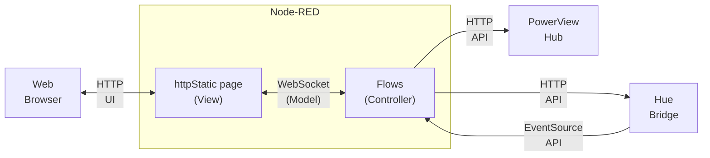

# home-automation

Node-RED based home automation system

> **Note:** these flows use features introduced in Node-RED version 3.0,
> including wire junctions and dynamic links. They will not load
> correctly into earlier versions of Node-RED.

## About

These flows implement more sophisticated time-based automation than is
supported directly by popular home automation platforms like Apple HomeKit,
Amazon Alexa, Google Home, Samsung SmartThings, etc., or the native
apps supplied by Philips and Hunter-Douglas. For example, they activate
different seasonal lighting themes automatically based on the date. They
also drive window shade automation based on the sun's position over the
course of a day based on the geographic location of the home and the day
of the year.

## Installation

0. (Optional) Install your desired version of _Node_, e.g. using the
   [nodesource](https://nodesource.com/) repository for your host platform
   (make sure to choose a version that is compatible with your target
   version of Node-RED 3.0 or later)

1. Install Node-RED 3.0 or later as per
   <https://nodered.org/docs/getting-started/> (if you skipped step 0 then
   the standard install script for Debian based hosts will attempt to
   install or upgrade _Node_ if no compatible version is found but then
   you may be left with a version of _Node_ that is behind the current LTS)

2. Enable "projects" in Node-RED's _settings.js_

3. Install the [dependencies described below](#dependencies)

4. Adjust [_settings.js_](#settings) and add the
  [environment variables](#environment) described below

5. Restart the Node-RED process

6. Create a fork of <https://github.com/parasaurolophus/home-automation>
   so that you can easily customize your configuration and use Git to
   safely manage it

7. Use Node-RED's "open project" feature to clone your forked repository
   into your local project folder

8. In a terminal,
   ```
   cd ~/.node-red/<user>/projects/home-automation/dashboard
   npm run build
   ```
   to create the
   _~/.node-red/&lt;user&gt;/projects/home-automation/dashboard/dist_ directory

If all goes well, opening the Node-RED editor will allow you to examine and
modify these flows. Browsing to your Node-RED instance's URL with
.../dashboard_ added to the end of the URL will open the _Vuetify_ based
dashboard. Note that you will have to edit the contents of _Automation_
and _Hue_ flows to match your hardware setup and scene configuration in
order for the Hue controls to be generated on the dashboard and the time
and date based lighting automations to have the intended effect.

## Dependencies

The following node packages must be installed before loading these
flows into your environment:

- [node-red-node-discovery](https://flows.nodered.org/node/node-red-node-discovery)
- [@parasaurolophus/node-red-eventsource](https://flows.nodered.org/node/@parasaurolophus/node-red-eventsource)

In addition, some `function` nodes in these flows load the
[suncalc](https://www.npmjs.com/package/suncalc) package dynamically,
which must be enabled in _settings.js_ (true by default).

## Configuration

These flow assume a certain amount of configuration, both in
_settings.js_ and via environment variables (e.g.
_~/.node-red/environment_ or globally in the host operating
system's shell).

### Settings

Some non-default options must be configured by editing Node-RED's
_settings.js_

#### File System Context Store Named "file"

```
contextStorage: {
      default: { module: 'memory' },
      file: { module: 'localfilesystem' }
  },
```

#### Static HTTP Content

For example, if you use Node-RED's _projects_ feature to clone these
flows from GitHub:

```
httpStatic: [
    {path: '/home/<user>/.node-red/projects/automation/dashboard/dist/', root: "/dashboard/"}, 
],
```

where `<user>` is the name of the user as whom the Node-RED service is running.

### Environment

> _**Note:** There are a number of ways to set environment variables for
> the Node-RED process, none of which are very well documented. The most
> straightforward way is to add lines in_ settings.js _above
> `module.exports` of the form:_
>
> ```
> process.env.MY_VAR = 'my value'
> process.env.MY_OTHER_VAR = 'my other value'
>
> module.exports = {
> ```
>
> _To make it easier to share environments across Node-RED instances,
> you could put the environment variable definitions in their own
> module which is then imported into_ settings.js _using `require`:_
>
> ```
> var environment = require('./environment')
>
> module.exports = {
> ```
>
> _in which case there should also be an_ environment.js _file in
> the same directory as_ settings.js _which contains something like:_
>
> ```
> module.exports = {
>     my_var: process.env.MY_VAR = 'my value',
>     my_other_var: process.env.MY_OTHER_VAR = 'my other value'
> }
> ```

These flows rely on some sensitive configuration data provided via
environment variables:

| Environment Variable       | Description                                                                          |
|----------------------------|--------------------------------------------------------------------------------------|
| `LATITUDE`                 | Coordinate for use with [suncalc](https://www.npmjs.com/package/suncalc)             |
| `LONGITUDE`                | Coordinate for use with [suncalc](https://www.npmjs.com/package/suncalc)             |
| `GROUND_FLOOR_HUE_ADDRESS` | IP address of the Hue Bridge controlling devices on the ground floor                 |
| `GROUND_FLOOR_HUE_KEY`     | API access token for the ground floor Hue Bridge                                     |
| `BASEMENT_HUE_ADDRESS`     | IP address of the Hue Bridge controlling devices in the basement                     |
| `BASEMENT_HUE_KEY`         | API access token for the basement Hue Bridge                                         |
| `POWERVIEW_ADDRESS`        | IP address of the PowerView hub                                                      |
| `BROKER_URL`               | The URL to use to when connecting as a client to the WebSocket served by these flows |

There are two configuraton properties per Hue bridge: its address and
access token for use by Node-RED. These flows include a browser-based user
interface for creating such access tokens where they are referred to as
"keys."

`${BROKER_URL}` is used to enable the possibility of extracting the
flow which hosts the `/broker` WebSocket server from these home
automation flows and running it on a separate instance of Node-RED.

## Features

- Local control of Philips Hue lighting and Hunter-Douglas (PowerView)
  window coverings using the API's published by their respective hubs

- Dynamically created dashboard controls for individual device groups
  and scenes created by querying the Hue and PowerView hubs

- Home automation driven by date, time and the position of the sun
  over the course of each day of the year

- Support multiple Hue hubs concurrently

The implementation of these  features provides practical demonstrations
of a number of basic software-engineering concepts such as event-driven
programming and data-driven user interfaces. It also serves as a
repository of examples of a number of techniques specific to Node-RED as a
home automation platform and how it interoperates with underlying
technologies such as WebSockets, JavaScript embedded in HTML and so on.

### Requirements

The goals for these flows include:

1. More sophisticated automation rules than supported directly by
   the native apps and off-the-shelf "smart home" platforms supplied
   by companies like Philips, Hunter-Douglas, Apple, Google, Amazon,
   Samsung etc.

2. Support a consolidated user interface easily accessible by anyone
   in the home, including guests, without having to own a specific
   make of mobile device, install specific apps, be granted explicit
   network access or create accounts with any so-called "cloud services"

3. Eliminate the use of third-party "clouds" to the greatest degree
   possible due to performance, reliability, security and privacy
   concerns

The home in question has a number of "smart" devices from multiple
manufacturers, none of which come with any ability to interoperate
directly with one another. Home automation platforms from companies like
Apple, Google and Amazon are woefully inadequate in many respects, and
each requires anyone attempting to do things as simple as turning on and
off lights to have a specific app, with a properly configured account,
with that account given pretty much _carte blanche_ authority to do
anything it likes to every aspect of the "smart" home, mediated by
"cloud services" owned and operated by third-parties with their own
agendas that trump any consideration of their customers' security or
privacy.

Using Node-RED allows for a fairly intuitive user interface that can be
accessed with no more specialized an app than a web browser. Further,
Node-RED can be programmed to do anything that can be accomplished in a
general-purpose programming language, JavaScript, rather than being
constrained by the features made available at the whim of companies
more interested in extending their surveillance and control over their
"walled gardens" than in providing useful products and services.

### User interface

> _**Warning!** There is a build step required after cloning the
> repository for these flows in order for the dashboard to be
> available at `https://<nodered-host>:1880/dashboard`_
>
> ```
> cd ~/.node-red/projects/home-automation/dashboard
> npm run build
>```
>
> _This invokes the Vue / Vuetify tooling to create the contents
> of the _dist_ directory referenced by the `httpStatic` setting
> [described above](#static-http-content)._

These Node-RED flows do not directly implement any user interface.
Instead, they asynchronously send event messages and receive
command messages using a WebSocket node configured to "listen to" the
URI `/broker`. In addition to and separate from _flows.json_, the GitHub
repository for these flows includes a subdirectory, _dashboard_,
which implements a "single page web application" that connects to
the `/broker` WebSocket listener in Node-RED and presents a user inteface
composed of [Vuetify 3](https://next.vuetifyjs.com/) components. They
make extensive use of [Vue 3](https://vuejs.org) features to implement
a highly reactive user interface that automatically adapts to configuration
changes made in the Hue and PowerView native apps.



This allows for a complete separation between the _view_ implemented using
_Vuetify_, the _model_ transmitted as message payloads using WebSockets
and Node-RED flows as the _controller_ in the so-called MVC (Model, View,
Controller) architectural pattern. The result is that these flows
display a consolidated user interface for controlling diverse devices
from multiple vendors without having to be edited whenever those
devices' configuration is changed in their respective native apps. They
do this using features directly supported by modern web browsers without
requiring the intermingling of front-end and back-end logic directly
within the Node-RED flows. This is why these flows have no dependency
on _node-red-dashboard_ nor any of the community supported packages
intended to replace it. All of the functionality that would be supplied by
any such package is entirely encapsulated within the _dashboard/dist_
directory that must be built after downloading this repository from
GitHub. With the appropriate configuration of _settings.js_ as
[described above](#static-http-content), you can access
_dashboard/dist/index.html_ using Node-RED's built-in web server and the
web page will automatically deduce the correct URL with which to connect
to the `/broker` WebSocket server implemented by these flows.

The reason for this strict separation between view and control is
not a dogmatic adherence to theoretical purity in the domain of
software architecture. The sad truth is that while Node-RED greatly
benefits from the culture of an open source community project,
it also suffers from the inevitable shortcomings of such products.
(This is not unique to software: the many challenges of relying on
any open source product is a specific example of [the tragedy of
the commons](https://en.wikipedia.org/wiki/Tragedy_of_the_commons)
about which political and economic theorists have written for
centuries.) The _node-red-dashboard_ component, supplied by Node-RED's
core development team, suffers from the kind of "bit rot" that always --
no, really, **always** -- infects open source projects' repositories while
community-supplied components vary widely in their quality. Support by
their authors is often intermittent and ephemeral. That is why these flows
are designed to rely on as few add-on components as possible. They use
core nodes such as `http request` to access the various device API's
directly rather than using node packages that wrap them because this
reduces exposure to defects and deficiencies in third-party components.
The one critical bit of functionality that is implemented as a community
supplied node package was created by the same author for the specific
needs of accessing the Philips Hue Bridge API from within these flows.
(The author feels confident in sufficiently prompt and diligent responses
to bug reports and feature requests he makes to himself, while having no
illusions nor unreasonable expectations regarding the priority such issues
would be given by someone else who created some similar package for their
own purposes, who knows how long ago, and then moved on to who knows
where.)

Note that once built, the _dist_ directory contains only HTML, JavaScript,
CSS and similar standard web content files. It does not require any
special code on the web server. It uses only the native WebSocket support
built into modern web browsers to communicate with the Node-RED back end
and all dynamic rendering is done on the client side using JavaScript and
the DOM API also built into web browsers. It does use certain browser
features that require it to be loaded with a URL beginning with `http://`
or `https://`, but it does not actually rely directly on any "server side
rendering" code.

> _To emphasize this point, an early version of this repository
> had a version of the dashboard implemented without the use of
> any client-side tooling but, rather, hand-crafted HTML,
> CSS and JavaScript. Frameworks like_ Vue / Vuetify _provide
> only "nice to have" features that enhance maintainability and
> readability of the HTML, not essential features required for
> the core functionality._

## Theory of Operation

The automation features that are the core of these flows are implemented as
a series of "trigger" events that are emitted up to six times per day when
particular time and date conditions are met. Each "trigger" event has
`msg.topic` set to `auomtation/trigger` and `msg.payload` containing a
JavaScript object with the following properties:

| `msg.payload[]`      | Description                                                                                     |
|----------------------|-------------------------------------------------------------------------------------------------|
| `timer/theme`        | One of the [theme](#theme) values described below                                               |
| `timer/time`         | One of the [time](#time) values described below                                                 |
| `settings/lighting`  | A boolean value indicating whether or not lighting automation has been enabled by a user        |
| `settings/shades`    | A boolean value indicating whether or not window covering automation has been enabled by a user |

The dashboard includes controls for controlling the values for
`msg.payload['settings/lighting']` and `msg.payload['settings/shades']`.

### Theme

The payload of each `automation/trigger` event has
`msg.payload['timer/theme']` set to one of following values:

| `msg.payload['timer/theme']` | Description                      |
|------------------------------|----------------------------------|
| `tribal`                     | July 1 - 4 (US Independence Day) |
| `spooky`                     | Any day in October               |
| `jolly`                      | Any day in December              |
| `standard`                   | Any other day                    |

### Time

The payload of each `automation/trigger` event has `msg.payload['timer/time']` set to one of the following values:

| `msg.payload['timer/time']` | Description                                                                                                                          |
|-----------------------------|--------------------------------------------------------------------------------------------------------------------------------------|
| `sunrise`                   | Sent at sunrise<sup>1</sup>                                                                                                          |
| `midday`                    | Sent if and when the sun first reaches an altitude of 0.8 radians on a given day<sup>2</sup>                                         |
| `afternoon`                 | Sent when the sun first drops below an altitude of 0.8 after it has reached an azimuth greater than 0.0 (i.e. shining from the west) |
| `sunset`                    | Sent at sunset                                                                                                                       |
| `bedtime`                   | Sent at somewhat randomized time each evening<sup>3</sup>                                                                            |

Notes:

<sup>1</sup> All times of day and sun coordinates are obtained using
[suncalc](https://www.npmjs.com/package/suncalc) and require that the
`${LATITUDE}` and `${LONGITUDE}` environment variables be set as
[described above](#environment)

<sup>2</sup> No `midday` event will be sent on days on which the sun
never reaches an altitude of 0.8 radians

<sup>3</sup> The exact time at which `bedtime` events deliberately varies
each day. It will be sent at a time that is up to 30 minutes before or
after the time selected by a user on the dashboard.